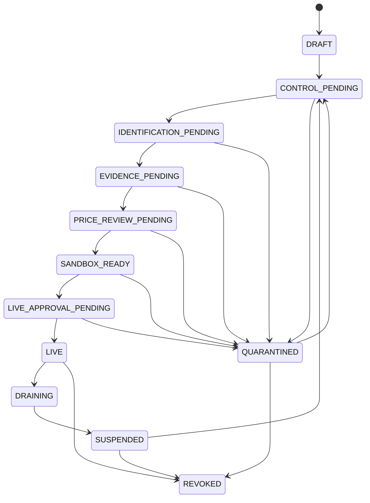
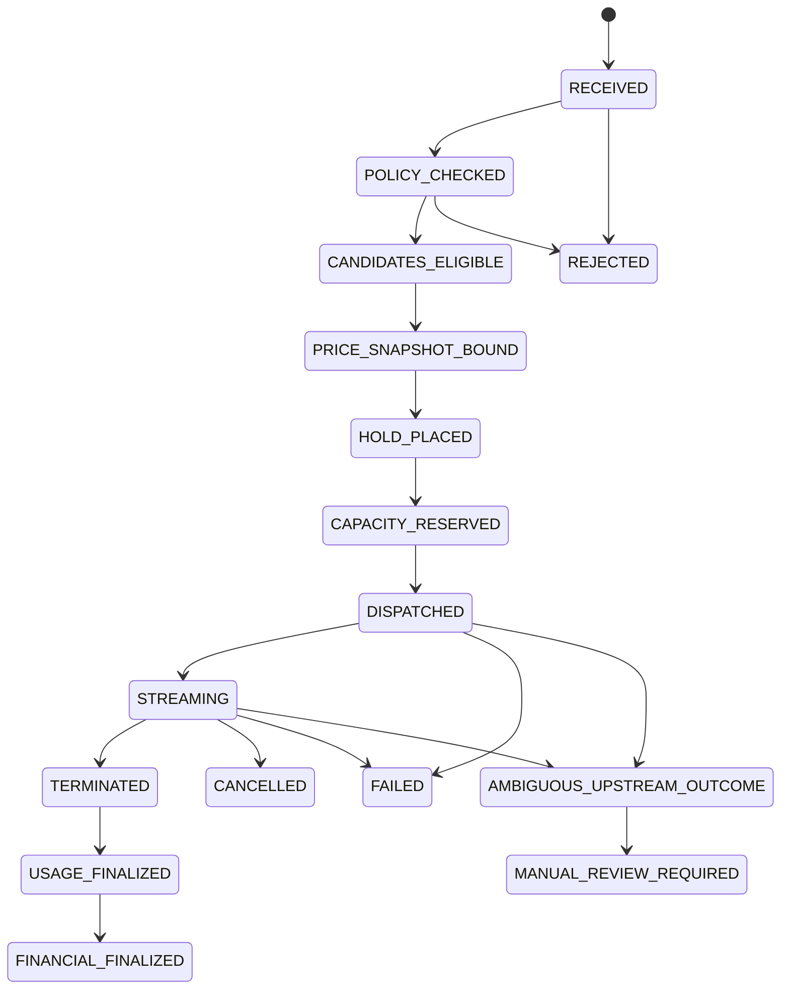

# Supplier routing state machines

- Status: Draft for Phase 2 freeze
- Date: 2026-08-30

Admission, runtime health and a single inference call are separate state machines. A healthy endpoint cannot override missing evidence, and an admitted endpoint cannot override an open circuit breaker.

## Endpoint admission

An endpoint cannot enter `LIVE` while its compliance cell is `PENDING_REVIEW`, `PROHIBITED` or `STALE_EVIDENCE`. Address, protocol, account, operator, model mapping, region, credential reference or price changes create a new reviewed version rather than mutating the admitted version.

## Health and circuit breaker

Health is `UNKNOWN`, `HEALTHY`, `DEGRADED` or `UNHEALTHY`. Circuit state is `CLOSED`, `OPEN` or `HALF_OPEN`. These signals cannot reactivate `SUSPENDED`, `QUARANTINED`, `REVOKED` or non-admitted endpoints.

## Inference call

Every transition is idempotent and audited. The route decision stores stable exclusion reasons for every candidate and snapshots policy, endpoint, authorization, canonical model, meter schema, price, health, capacity and SLA versions.

No-output retries require an unambiguous failed attempt and compatible idempotency. After first byte, the platform does not automatically dispatch to another supplier. Cancellation still records partial usage. An ambiguous upstream outcome cannot be declared successful or retried merely because the network timed out.
