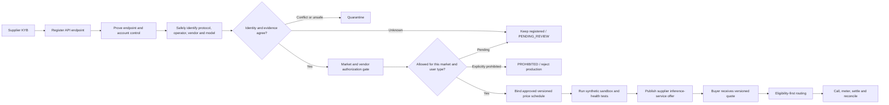

# Supplier API marketplace flow

- Status: Draft for Phase 2 freeze
- Decision date: 2026-08-30
- Requested change: suppliers provide API endpoints; the platform identifies the service vendor/model and sells the service using the corresponding approved price schedule.

## Product interpretation

The platform sells metered inference service delivered through a supplier-controlled API endpoint. It does not buy or resell account balances, consumer subscriptions, promotional credits, shared keys or transferable wallet value.

The production flow is:

Identification is an input to admission; it is never admission by itself. Before research, vendors and endpoints remain registrable as `PENDING_REVIEW` rather than being presumed prohibited. A successful probe cannot prove commercial authorization, account ownership, credit origin, data residency or an approved price.

## Separate identities

The data model must keep these fields distinct:

- `endpoint_operator`: the KYB supplier operating the submitted endpoint;
- `endpoint_class`: `VENDOR_OFFICIAL` or `SUPPLIER_GATEWAY`;
- `protocol_family`: the wire protocol implemented by the endpoint;
- `claimed_upstream_vendor`: the supplier's declaration;
- `verified_upstream_vendor`: the vendor established by approved evidence, or absent;
- `canonical_model_id`: the admitted model/version, not an arbitrary seller alias;
- `vendor_detection_status`: `UNIDENTIFIED`, `CANDIDATE`, `VERIFIED`, or `CONFLICT`;
- `commercial_evidence_status`: one of the compliance evidence statuses;
- `market_admission_status`: the market-specific operational state.

Protocol compatibility, a vendor-like URL, response headers, model names, error text, TLS identity, network location or a successful API request must not alone set `verified_upstream_vendor`.

## Supplier submission

A supplier endpoint record must contain:

- supplier organization and market IDs;
- normalized HTTPS base URL, approved port and path prefix;
- endpoint class and declared protocol version;
- declared vendor, account owner, model catalog, service regions and inference location;
- data-processing, logging, backup, subprocessor and cross-border declarations;
- secret-manager reference or supplier control-node reference, never a raw credential;
- capacity, rate limits, timeout, SLA and incident-notification policy;
- authorization and account-ownership evidence references;
- price-schedule proposal and currency;
- control challenge, review, expiry and next-reverification timestamps.

Only KYB organizations may submit production candidates. Personal subscriptions, personal API accounts, free trials, grants, promotions, shared credentials, account rental and unsupported credit resale are rejected.

## Safe endpoint verification

The first release may connect only to versioned official-domain allowlists or reviewed supplier gateways. Arbitrary URLs cannot become production routes.

Verification must:

1. canonicalize the URL and permit HTTPS plus approved ports only;
2. reject URL user information, custom proxies, unapproved certificate authorities and buyer-controlled destinations;
3. resolve and validate the full DNS/CNAME chain at approval and connection time;
4. block loopback, private, link-local, multicast, reserved and metadata destinations across IPv4/IPv6 and encoded forms;
5. use a market-scoped isolated egress proxy rather than the control plane;
6. prove endpoint control through a one-time challenge or approved vendor management mechanism;
7. avoid attaching a credential until the final host is validated and never forward authorization across hosts or redirects;
8. bound redirects, response size, decompression, connection time, first-byte time and stream duration;
9. use synthetic, non-customer probe content and redact all logs;
10. pin the approved host/path, endpoint identity and market egress policy.

Official vendor endpoints and supplier gateways remain visibly different. A compatible supplier gateway cannot be branded as the upstream vendor unless the upstream chain is separately verified.

## Endpoint lifecycle

Allowed forward states are:

`DRAFT → CONTROL_PENDING → IDENTIFICATION_PENDING → EVIDENCE_PENDING → PRICE_REVIEW_PENDING → SANDBOX_READY → LIVE_APPROVAL_PENDING → LIVE`

`SUSPENDED` and `REVOKED` may be entered from any post-draft state. Unknown identity stays registered in `IDENTIFICATION_PENDING` or `EVIDENCE_PENDING`; it is not presumed prohibited. Conflicting evidence or failed safety checks may quarantine it. Only explicit evidence can mark it `PROHIBITED`, and none of those states can skip to production.

Changes to URL, DNS/CNAME, certificate/mTLS identity, endpoint operator, vendor account, secret reference, canonical model set, region, metering contract or price schedule suspend new routing and trigger the relevant re-verification. Evidence becoming stale or prohibited also suspends routing.

## Corresponding-price rule

“Corresponding price” means the active, approved price-schedule version bound to the verified tuple:

`market × supplier × endpoint × verified vendor × canonical model × region × meter type × currency`

It is not inferred from the endpoint response or copied blindly from a public vendor list price.

Four immutable version types remain separate:

1. `VendorListPriceSnapshot`: a dated public-price observation used only for comparison, anomaly detection and reconciliation;
2. `SupplyOfferVersion`: the approved supplier service price and settlement basis;
3. `PricingPolicyVersion`, `CommissionPolicyVersion` and `TaxDeterminationVersion`: the approved market rules applied by the platform;
4. `BuyerQuoteVersion`: the final buyer-facing price and maximum-charge snapshot.

Settlement never looks up a mutable “current price”. Every call pins all four applicable versions plus the vendor identification, authorization decision, model mapping, adapter and meter-schema versions.

Each price schedule records:

- source type and private evidence reference;
- exact currency and supported market;
- canonical model/version and region;
- meter dimensions such as input, output, cached input, tool call or request;
- exact unit quantum, rate, minimum charge and rounding rule;
- effective-from, expires-at and immutable version;
- supplier cost, disclosed platform fee rule and tax treatment;
- approving operator/reviewer and audit event.

Money uses integer minor units or exact decimals. The retail quote snapshots supplier cost, platform fee, tax, currency, expiry and maximum hold. Unused hold is released. Reserve and payout delay affect supplier settlement rather than silently changing the buyer price.

A vendor public price may be an anomaly-check reference. It is not proof of the supplier's contract price or resale permission. Price/model/region/currency/meter mismatches fail closed.

The initial sandbox accounting model is transparent cost-plus in one market settlement currency:

- `S`: actual supplier-service amount calculated from the selected `SupplyOfferVersion`;
- `Cs`: supplier-paid platform commission;
- `Cb`: buyer-paid platform service fee;
- `T`: tax line items from the approved tax policy;
- `P`: an explicitly approved promotion funded from a promotion-expense account;
- `buyer_charge = S + Cb + T - P`;
- `seller_payable = S - Cs`;
- `platform_revenue = Cs + Cb`.

The applicable market pack must decide which fee side is permitted and how the platform is legally characterized. It cannot switch accounting presentation at runtime. FX is rejected in the first release: supply offer, quote, market ledger, payment charge and payout use the same approved settlement currency.

## Routing consequences

Routing first filters by endpoint state, market admission, written authorization, user type, data residency, AUP, model, capacity, budget and health. Only eligible endpoints are ranked by the approved buyer price, health and SLA. Lowest price never overrides an eligibility failure.

The quote also pins the allowed fallback-offer set. A fallback cannot increase the buyer's price. A retry to another endpoint is allowed only before output, with an unambiguous upstream outcome and compatible idempotency/metering semantics. After the first streamed byte, automatic cross-endpoint failover is disabled; partial usage and ambiguous outcomes are finalized explicitly rather than guessed.

Every inference call must link the endpoint identity version, price-schedule version, quote, route decision, metering record, ledger entries, supplier settlement and audit event.

## Sandbox vertical slice

Phase 3 becomes:

`Supplier KYB fixture → register mock API endpoint → prove control → identify mock vendor/protocol/model → approve synthetic evidence → publish versioned price → buyer sandbox funding → quote and hold → API call → usage confirmation → charge → platform commission → supplier receivable → sandbox payout → refund/chargeback → reconciliation`

Completing this with mock funds is not payment-provider sandbox verification and does not authorize production.

## Acceptance tests

- Unknown vendor identity remains registered as `PENDING_REVIEW`; conflicting or unsafe identity is quarantined rather than deleted.
- A protocol-compatible impostor is not identified as the protocol's namesake vendor.
- Private, loopback, metadata, encoded-IP, DNS-rebinding and redirect targets are rejected.
- Authorization is never forwarded to an unapproved or redirected host.
- Endpoint/control/vendor/model/evidence drift suspends routing.
- Personal, trial, promotional or shared-account evidence is rejected.
- Price schedules with wrong model, region, currency, unit, time range or meter fail closed.
- In-flight calls keep their immutable quote/price snapshot during a later price change.
- Exact-decimal calculations preserve ledger balance at rounding boundaries.
- Duplicate publication, probe, call and metering events have one financial effect.
- Evidence expiry prevents new routes, charges and supplier settlement as specified by policy.
- Logs, traces and failures contain neither supplier credentials nor full prompts/outputs.
